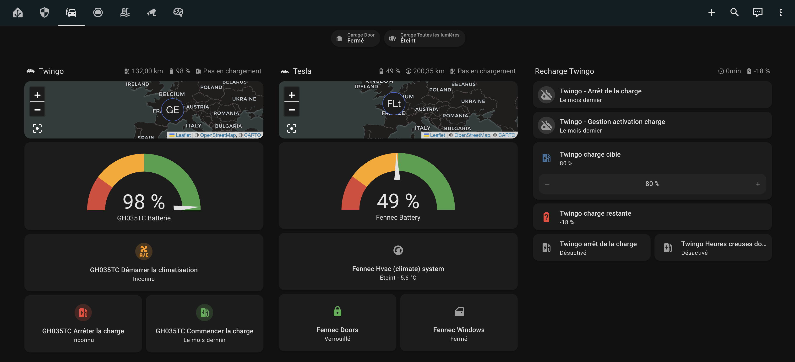

  
  

     
    ✨ Le tableau de bord moderne et intuitif Plug n Play qui organise automatiquement vos pièces et appareils en sections intelligentes. Home Assistant n’a jamais été aussi beau ! ✨
     
    

      <a href="README.md"><strong>🇬🇧 Lire en anglais</strong></a>
    

    
    
    
  

    

  

    
    
    
    
    
    
  

  <a href="https://thankyou-linus.com/"><strong>En savoir plus »</strong></a>
   
   

## 🚀 Pourquoi Linus Dashboard ?

### Le Problème avec les Tableaux de Bord Traditionnels

- 😓 **Organiser manuellement 100+ appareils prend des heures** d'édition YAML
- 🔄 **Chaque nouvel appareil nécessite une reconfiguration** à travers plusieurs vues
- 📱 **Configuration complexe** juste pour une navigation basique
- 👨‍👩‍👧 **Les membres de la famille ne trouvent pas les contrôles** dans votre tableau de bord personnalisé

### Comment Linus Résout Ces Problèmes

✅ **5 minutes de configuration** vs 2+ heures de configuration manuelle

✅ **2 clics maximum** pour accéder à n'importe quel appareil

✅ **Zéro YAML** - configuration visuelle uniquement

✅ **Organisation automatique** - les nouveaux appareils apparaissent instantanément au bon endroit

### Résultats Concrets

⚡ Supporte de 10 à 1000+ appareils sans effort

🎯 Navigation intuitive que tout le monde peut comprendre

📊 Fonctionne seul ou aux côtés de vos tableaux de bord personnalisés

---

## ✨ Qu'est-ce que Linus Dashboard ?

Linus Dashboard est un tableau de bord magique Plug n Play conçu pour simplifier et améliorer votre expérience Home Assistant.
Il organise automatiquement vos appareils en sections intelligentes, regroupées par pièces et types d'appareils, sans nécessiter de configuration compliquée.

**Fonctionnalités principales** :

- 🏠 **Navigation Intelligente par Pièce**
  Toutes les lumières, capteurs et contrôles climatiques de votre chambre au même endroit. Plus besoin de chercher dans les listes d'entités.

- 📟 **Vues Appareil qui Font Sens**
  Contrôlez toutes vos lumières de la maison depuis un seul écran. Même chose pour les volets, interrupteurs ou tout type d'appareil.

- 🎨 **Magnifique sur Tous les Écrans**
  S'adapte automatiquement au mobile, tablette et desktop. Superbe partout.

- 🔗 **Gardez Vos Tableaux de Bord Personnalisés**
  Vous avez déjà créé la vue énergétique parfaite ? Intégrez-la dans Linus ! [En savoir plus →](docs/EMBEDDED_DASHBOARDS.md)

- ⚡ **Installation en 5 Minutes**
  Branchez, utilisez et profitez. Aucun YAML requis.

Que vous débutiez avec Home Assistant, Linus Dashboard est la solution idéale pour une interface propre, organisée et intuitive.

> **Envie de découvrir tout le potentiel de l'automatisation et de la personnalisation de votre maison connectée ?**
> Explorez [thankyou-linus.com](https://thankyou-linus.com/) pour en savoir plus sur Linus et bien plus encore.

---

## 🎥 Ils Parlent de Nous

Découvrez ce que dit la communauté sur Linus Dashboard !

### Critiques & Tutoriels en Vedette

**BeardedTinker** - Présentation Complète de Linus Dashboard & Guide d'Installation

---

**Tutoriel Complet** - Tout Ce Qu'il Faut Savoir sur Linus Dashboard

---

**Guide de Configuration** - Démarrage Rapide avec Linus Dashboard

**Vous voulez créer du contenu sur Linus Dashboard ?** On adorerait vous mettre en avant ici ! Contactez-nous sur [Discord](https://discord.com/invite/ej2Xn4GTww) ou taguez-nous sur les réseaux sociaux.

---

## 🎨 Gardez Vos Tableaux de Bord Personnalisés

Vous avez déjà créé la vue parfaite pour le monitoring énergétique ? Une grille de caméras ? Un centre multimédia ?

**Ne repartez pas de zéro** - intégrez vos tableaux de bord existants directement dans Linus !

_Exemple : Tableau de bord énergétique intégré de manière transparente dans Linus_

✅ **Utilisez Linus** pour l'organisation automatique des appareils
✅ **Gardez vos vues personnalisées** pour le monitoring spécialisé
✅ **Intégration transparente** - tout au même endroit

**Cas d'usage populaires :**

- 📊 Monitoring énergétique avec graphiques historiques
- 📹 Vue multi-caméras de sécurité
- 🎵 Centre de contrôle multimédia
- 🌡️ Tableaux de bord climat & qualité de l'air

[Guide complet avec configuration étape par étape →](docs/EMBEDDED_DASHBOARDS.md)

---

## 🌟 Fonctionnalités que vous allez adorer

  

---

  

---

  

---

  

## 📦 Guide d'installation

**Nouveau sur Linus?** → [🚀 Guide de Démarrage Rapide 5 Minutes](docs/QUICK_START.md)

**Découvrez les fonctionnalités :**
- [📊 Guide de Détection d'Activité](docs/ACTIVITY_DETECTION.md) - Comprendre le suivi d'occupation des pièces
- [📖 Tableaux de Bord Intégrés](docs/EMBEDDED_DASHBOARDS.md) - Intégrer des vues personnalisées
- [📚 Carte Complète de la Documentation](docs/DOCUMENTATION_MAP.md) - Index complet des guides

### Prérequis

- **Home Assistant** (version 2023.9 ou plus récente recommandée).
- **HACS** (Home Assistant Community Store), facultatif mais recommandé pour simplifier les mises à jour.

### 🎥 **Tutoriel d’installation**

- **Option 1:** Pour un guide complet, regardez la vidéo YouTube de l’excellent @BeardedConti où il présente le Linus Dashboard et explique le processus d’installation (vidéo en anglais, sous-titres disponibles) :
  :arrow_forward: [Voir la vidéo](https://www.youtube.com/watch?v=GHE_UIczBCQ&t=367s&ab_channel=BeardedTinker)

- **Option 2:** Pour un aperçu visuel rapide, voici une capture d’écran silencieuse montrant le processus d’installation :
  [**Lien de la vidéo**](https://youtu.be/MLkVmtXgNBE?si=clJ1sREewRWDkTnE)

### Méthodes d’installation

#### Option 1 : Via HACS (Recommandé)

1. Ouvrez Home Assistant et allez dans **HACS > Intégrations**.
2. Recherchez directement **Linus Dashboard** dans la liste des intégrations disponibles.
3. Cliquez sur **Installer**, puis redémarrez Home Assistant.

#### Option 2 : Installation manuelle

1. Téléchargez la dernière version depuis la page [Releases GitHub](https://github.com/Thank-you-Linus/Linus-Dashboard/releases).
2. Extrayez les fichiers et copiez le dossier `linus_dashboard` dans le répertoire `custom_components` de Home Assistant.
3. Redémarrez Home Assistant pour charger l’intégration.

---

### 🛠️ Configuration et utilisation

Après l’installation, suivez ces étapes :

1. **Redémarrez Home Assistant** après avoir installé Linus Dashboard via HACS.
2. Allez sur la page **Intégrations** de Home Assistant.
3. Recherchez et ajoutez **Linus Dashboard** comme nouvelle intégration.
4. Pendant la configuration, vous pouvez sélectionner une entité météo ou alarme (facultatif).
5. Une fois la configuration terminée, un nouvel **icône avec un nœud papillon** apparaîtra dans le menu de gauche. Cliquez dessus pour accéder directement à Linus Dashboard.

#### ✨ Astuce

- Si l’icône n’apparaît pas immédiatement, essayez de redémarrer Home Assistant à nouveau.

---

## ❓ Foire Aux Questions

### Installation & Configuration

**Q: Je ne vois pas l'icône nœud papillon 🎀**

1. Redémarrez Home Assistant (Paramètres → Système → Redémarrer)
2. Videz le cache du navigateur (Ctrl+F5 ou Cmd+Shift+R)
3. Vérifiez que l'intégration Linus Dashboard est configurée (Paramètres → Appareils et services)

**Q: Mes appareils ne s'affichent pas**

- ✅ Vérifiez que l'appareil est assigné à une zone (Paramètres → Zones)
- ✅ Vérifiez que l'appareil n'est pas dans les domaines exclus (Paramètres → Configuration Linus Dashboard)
- ✅ Certaines entités sont intentionnellement cachées (non disponibles, entités de configuration)

**Q: Comment réorganiser mes pièces ?**
Avec Home Assistant 2025.1+, vous pouvez glisser-déposer les pièces directement dans les paramètres HA (Paramètres → Zones et secteurs). Linus respecte automatiquement votre ordre manuel.
[En savoir plus →](docs/MANUAL_ORDERING.md)

### Fonctionnalités & Compatibilité

**Q: Puis-je utiliser Linus avec mon tableau de bord existant ?**
**Oui !** Utilisez les tableaux de bord intégrés pour intégrer vos vues personnalisées de manière transparente. Vous pouvez garder votre monitoring énergétique, vues caméras ou tout tableau de bord personnalisé tout en profitant de l'organisation automatique de Linus.
[Guide de configuration →](docs/EMBEDDED_DASHBOARDS.md)

**Q: Ai-je besoin de Linus Brain ?**
**Non** - Linus Dashboard fonctionne de manière autonome. Linus Brain est une mise à niveau optionnelle pour la détection d'activité par IA et l'automatisation avancée.
[Comparer les fonctionnalités →](https://thankyou-linus.com/)

### Dépannage

**Q: Je vois une erreur timeout ou un message rouge**

**Procédez comme suit :**

1. **Videz le cache :**

   - Navigateur : effacez le cache de votre navigateur
   - Application mobile Home Assistant : videz le cache de l'application via les paramètres de votre appareil
   - Si vous utilisez un proxy inverse ou un service DNS (Cloudflare par exemple), videz également le cache

2. **Forcez un rafraîchissement :**

   - **Windows** : appuyez sur `CTRL + F5`
   - **Mac** : maintenez `⇧ Shift` et cliquez sur le bouton de rechargement, ou maintenez `⌘ Cmd` + `⇧ Shift` puis appuyez sur `R`

3. **Vérifiez votre configuration :** assurez-vous que votre instance Home Assistant est correctement configurée et qu'il n'y a pas de problèmes réseau

**Vous rencontrez toujours des problèmes ?** Ouvrez un ticket sur le [dépôt GitHub](https://github.com/Thank-you-Linus/Linus-Dashboard/issues) avec les détails de votre configuration et le message d'erreur.

## 📣 Rejoignez la communauté

- 🌟 **Soutenez-nous** : [Étoiles GitHub](https://github.com/Thank-you-Linus/Linus-Dashboard/stargazers)
- 🐛 **Signaler un problème** : [Issues GitHub](https://github.com/Thank-you-Linus/Linus-Dashboard/issues)
- 💬 **Retour et support** : [Discord](https://discord.com/invite/ej2Xn4GTww)

## ❤️ Contribuer

Nous sommes toujours ouverts aux contributions !
Forkez le projet, proposez des améliorations ou signalez des bugs pour nous aider à améliorer Linus Dashboard.

  <h2>✨ Faites passer votre maison connectée au niveau supérieur ✨</h2>
  

    <strong>Curieux de savoir comment Linus peut transformer votre maison connectée ? Prêt pour plus d’automatisation et de personnalisation ?</strong> 
    Visitez <a href="https://thankyou-linus.com/">thankyou-linus.com</a> pour plonger dans l’écosystème Linus et découvrir toutes les possibilités.
  

  

