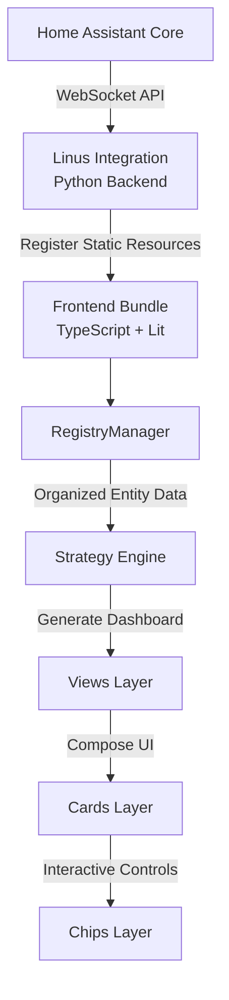
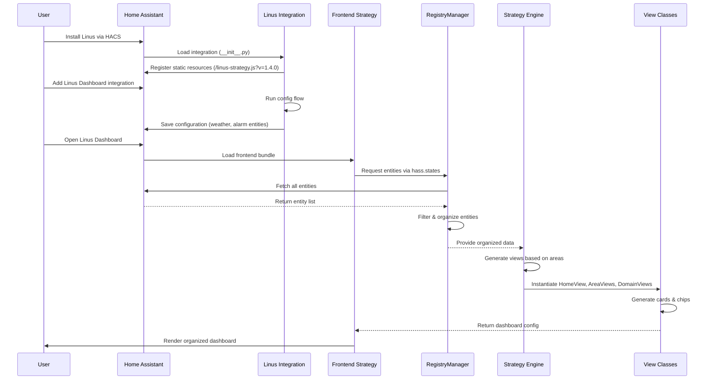
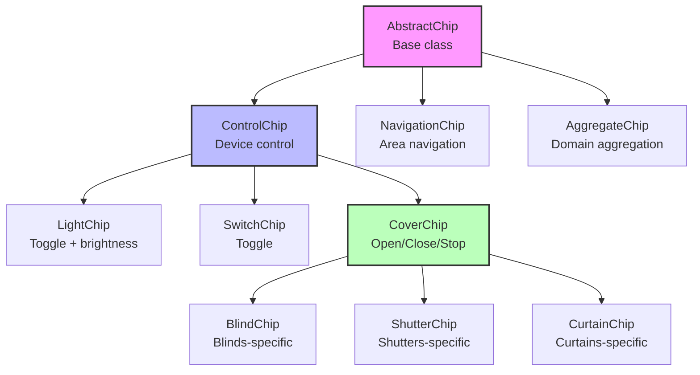
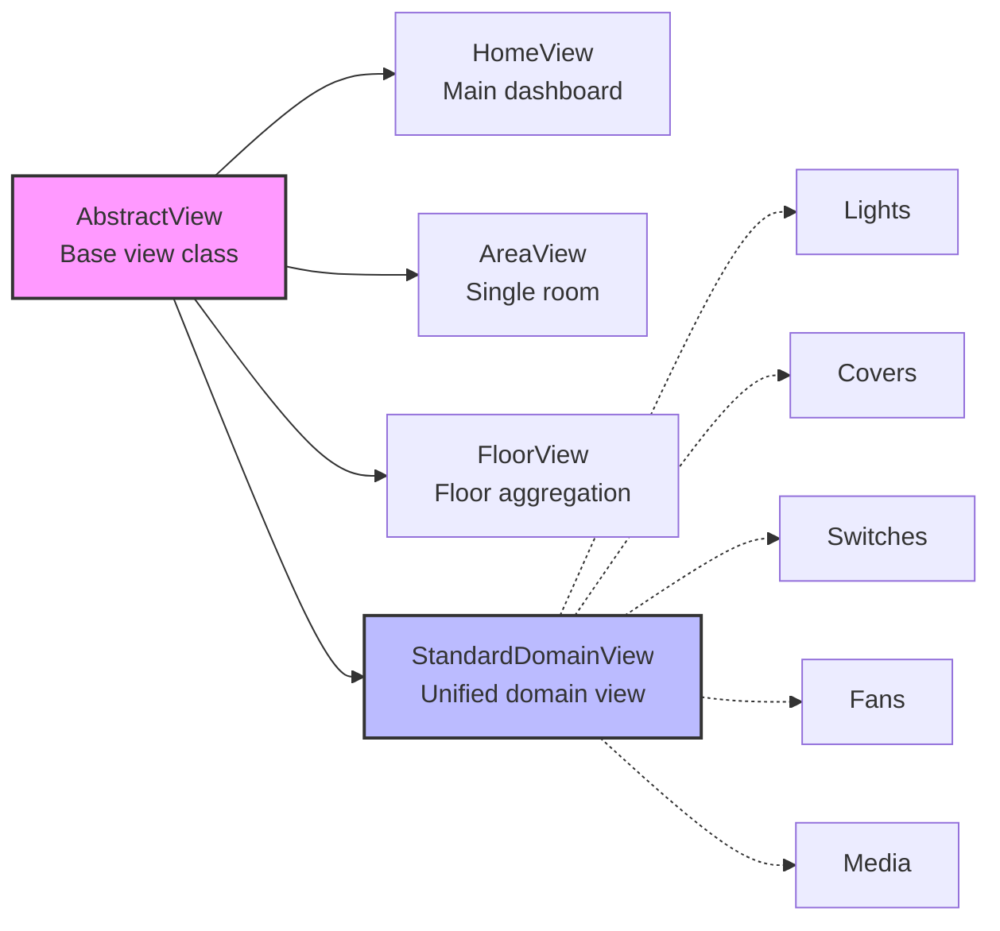
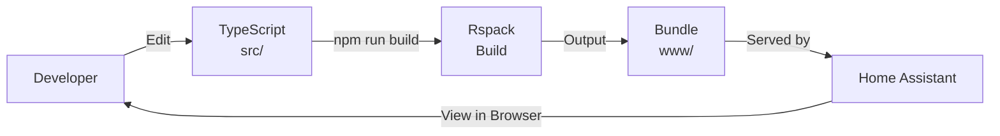

# 🏗️ Architecture Overview

**Quick Navigation:**
- [High-Level Architecture](#-high-level-architecture)
- [Technology Stack](#-technology-stack)
- [Project Structure](#-project-structure)
- [Data Flow](#-data-flow)
- [Component Architecture](#-component-architecture)
- [Deep Dives](#-deep-dives)

---

## 🎯 High-Level Architecture



**Key Concept:** Linus Dashboard is a Home Assistant **integration** (Python backend) + **strategy** (TypeScript frontend) that auto-generates dashboards from your existing entities.

---

## 🛠️ Technology Stack

### Backend (Python)

- **Home Assistant Integration API** - Config flow, resource registration
- **Manifest System** - Integration metadata and dependencies
- **Static Resource Management** - Frontend bundle registration with cache-busting

**Key Files:**
- [custom_components/linus_dashboard/\_\_init\_\_.py](../../custom_components/linus_dashboard/__init__.py) - Integration entry point
- [custom_components/linus_dashboard/config_flow.py](../../custom_components/linus_dashboard/config_flow.py) - Configuration UI
- [custom_components/linus_dashboard/manifest.json](../../custom_components/linus_dashboard/manifest.json) - Integration metadata

### Frontend (TypeScript)

- **Lit** (v3.x) - Web components framework for reactive UI
- **Mushroom Cards** - UI card library for consistent Home Assistant styling
- **Rspack** - Build tool (5-10× faster than Webpack)
- **TypeScript 5.x** - Full type safety across codebase

**Why Rspack?**
- ⚡ 5-10× faster build times vs Webpack
- 🔥 Better TypeScript support out of the box
- 🚀 Active development and Home Assistant compatibility

### Build & Development

- **Rspack** - Module bundler with hot reload
- **ESLint** - Linting (MANDATORY before commit - 0 errors required)
- **Prettier** - Code formatting
- **VS Code Dev Container** - Consistent dev environment with Python 3.13 + Node.js 20

**Deep dive:** [Memory Bank - Technology Stack](../.aidriven/memorybank.md#technology-stack)

---

## 📁 Project Structure

```
linus-dashboard/
├── custom_components/linus_dashboard/  # Backend (Python)
│   ├── __init__.py                     # Integration setup & resource registration
│   ├── config_flow.py                  # Configuration UI (weather, alarm selection)
│   ├── const.py                        # Constants (DOMAIN, version, paths)
│   ├── manifest.json                   # Integration metadata
│   └── translations/                   # i18n strings (en.json, fr.json)
│       ├── en.json                     # English translations
│       └── fr.json                     # French translations
│
├── src/                                # Frontend (TypeScript)
│   ├── linus-strategy.ts               # Main strategy engine (entry point)
│   ├── chips/                          # Chip components (interactive controls)
│   │   ├── AbstractChip.ts             # Base chip class
│   │   ├── ControlChip.ts              # Device control chips (lights, covers, etc.)
│   │   ├── NavigationChip.ts           # Area navigation chips
│   │   └── AggregateChip.ts            # Domain aggregation chips
│   ├── cards/                          # Card components (UI containers)
│   │   ├── AbstractCard.ts             # Base card class
│   │   ├── AreaCard.ts                 # Room/area cards
│   │   └── ControlCard.ts              # Device control cards
│   ├── views/                          # View classes (dashboard screens)
│   │   ├── AbstractView.ts             # Base view class
│   │   ├── HomeView.ts                 # Main dashboard view
│   │   ├── AreaView.ts                 # Single area/room view
│   │   ├── FloorView.ts                # Floor-level aggregation view
│   │   └── StandardDomainView.ts       # Unified domain views (lights, covers, etc.)
│   ├── popups/                         # Popup dialogs
│   ├── utils/                          # Helper utilities
│   │   ├── Helper.ts                   # Entity filtering, area helpers
│   │   └── RegistryManager.ts          # Entity registry management
│   └── types/                          # TypeScript definitions
│       └── strategy.ts                 # Core type definitions
│
├── build-scripts/                      # Rspack configuration
│   ├── rspack.config.js                # Main build config
│   └── package.json                    # Frontend dependencies
│
├── .aidriven/                          # AI development system
│   ├── memorybank.md                   # Complete architecture & decisions
│   ├── GLOSSARY.md                     # Standardized vocabulary
│   ├── TESTING_GUIDE.md                # Testing methodology
│   └── rules/                          # Coding standards (8 files, 67K+ lines)
│
└── docs/                               # Documentation
    ├── QUICK_START.md                  # 5-minute user guide
    ├── EMBEDDED_DASHBOARDS.md          # Custom dashboard integration
    ├── MANUAL_ORDERING.md              # HA 2025.1+ room ordering
    └── development/                    # Developer docs
        ├── ARCHITECTURE_OVERVIEW.md    # This file
        ├── CHIP_SYSTEM_ARCHITECTURE.md # Detailed chip system docs
        └── RELEASE_WORKFLOW.md         # Release process
```

**Deep dive:** [Memory Bank - File Structure](../.aidriven/memorybank.md#file-structure)

---

## 🔄 Data Flow

### Entity Registry Flow



**Key Points:**
- **No database** - Reads directly from Home Assistant's state machine
- **Real-time updates** - Entities update automatically via Home Assistant's reactive system
- **Zero configuration** - Areas, entities, and devices auto-detected
- **Cache-busting** - Version query parameter ensures fresh JavaScript

**Deep dive:** [Memory Bank - Data Flow](../.aidriven/memorybank.md#data-flow)

---

## 🧩 Component Architecture

### Chip System Hierarchy



**Design Pattern:** Abstract base classes with specialized implementations for each device type.

**New in v1.4.0:**
- **State-aware icons** - Chip icons change based on entity state (heating/cooling, open/closed)
- **Device class specialization** - Different chips for blinds, shutters, curtains
- **Smart control chips** - Quick actions without popups

**Deep dive:** [Chip System Architecture](CHIP_SYSTEM_ARCHITECTURE.md)

---

### View Architecture



**Key Innovation:** `StandardDomainView` eliminates code duplication by providing a unified implementation for all domain-specific views.

**Before (duplicated code):**
- `LightView`, `CoverView`, `SwitchView` each implemented separately
- ~200 lines of duplicated logic per view

**After (Phase 3 architecture):**
- Single `StandardDomainView` class handles all domains
- Configuration-driven approach
- 90% less code duplication

---

## 📚 Deep Dives

For detailed architecture of specific subsystems:

### Core Systems
- **[Chip System Architecture](CHIP_SYSTEM_ARCHITECTURE.md)** (795 lines) - Complete chip system documentation with diagrams, examples, and testing checklist
- **[Memory Bank](../.aidriven/memorybank.md)** - Complete project architecture, tech stack decisions, and design rationale
- **[Dashboard Enhancements](../DASHBOARD_ENHANCEMENTS.md)** - Feature architecture details, activity detection, security view

### Features
- **[Embedded Dashboards](../EMBEDDED_DASHBOARDS.md)** - How to integrate custom Lovelace dashboards
- **[Manual Ordering](../MANUAL_ORDERING.md)** - HA 2025.1+ drag & drop room ordering (Linus respects it automatically)
- **[Area Specific Entities](../AREA_SPECIFIC_ENTITIES.md)** - Temperature/humidity per area

### Development
- **[AI-Driven Workflow](../.aidriven/README.md)** - 2-phase development (Plan with Opus → Implement with Sonnet)
- **[Clean Code Rules](../.aidriven/rules/clean_code.md)** - TypeScript & Python standards
- **[Home Assistant Integration Patterns](../.aidriven/rules/homeassistant_integration.md)** - HA-specific best practices
- **[Testing Guide](../.aidriven/TESTING_GUIDE.md)** - Testing methodology and checklist

---

## 🎓 Learning Path

**For new developers:**

1. **Start here** → Read this overview (you are here) 📍
2. **Understand decisions** → Read [Memory Bank](../.aidriven/memorybank.md) for architecture rationale
3. **Learn the UI system** → Study [Chip System Architecture](CHIP_SYSTEM_ARCHITECTURE.md)
4. **Setup environment** → Follow [CONTRIBUTING.md](../../CONTRIBUTING.md)
5. **First contribution** → Pick a [good first issue](https://github.com/Thank-you-Linus/Linus-Dashboard/labels/good%20first%20issue)

**Estimated time:** 2 hours to understand core architecture → Ready to contribute

---

## 🔧 Build System

### Development Workflow



**Commands:**
```bash
make build         # Development build (fast, unminified)
make build-prod    # Production build (minified, optimized)
make build-watch   # Watch mode (auto-rebuild on changes)
make lint          # ESLint + Prettier (MANDATORY before commit)
```

**Cache-busting:**
- Frontend bundle registered with version query: `/linus-strategy.js?v=1.4.0`
- Version read from `manifest.json` on integration load
- Ensures users always get latest JavaScript after updates

---

## 📊 Key Metrics

**Codebase:**
- **Frontend:** ~15,000 lines TypeScript
- **Backend:** ~500 lines Python
- **Documentation:** 100,000+ lines (40+ markdown files)
- **Supported domains:** 15+ (light, cover, switch, climate, sensor, etc.)
- **Supported languages:** English, French

**Architecture evolution:**
- **Phase 1 (v1.0-1.2):** Basic views and cards
- **Phase 2 (v1.3):** Chip system introduction
- **Phase 3 (v1.4):** Factories pattern, StandardDomainView unification
- **Future (v2.0+):** WebSocket real-time updates, advanced customization

---

## 🤝 Contributing

Found an architecture issue? Want to propose improvements?

1. Check if it's documented in [Memory Bank](../.aidriven/memorybank.md)
2. Review [CONTRIBUTING.md](../../CONTRIBUTING.md) for contribution process
3. Use [AI-Driven Workflow](../.aidriven/README.md) for planning and implementation
4. Open a discussion on [GitHub](https://github.com/Thank-you-Linus/Linus-Dashboard/discussions)

---

## 📝 Maintenance

**This document is updated:**
- When core architecture changes (new layers, patterns)
- When technology stack evolves (dependency updates)
- When major refactoring occurs (Phase 3 → Phase 4)

**Last updated:** 2025-12-31 (v1.4.0-beta.6)

**Maintained by:** Linus Dashboard Core Team
