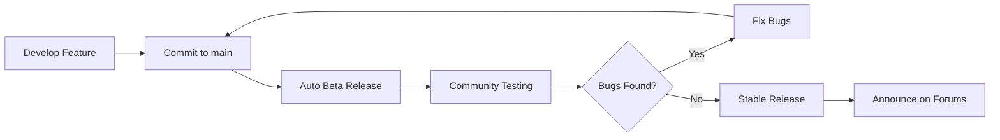
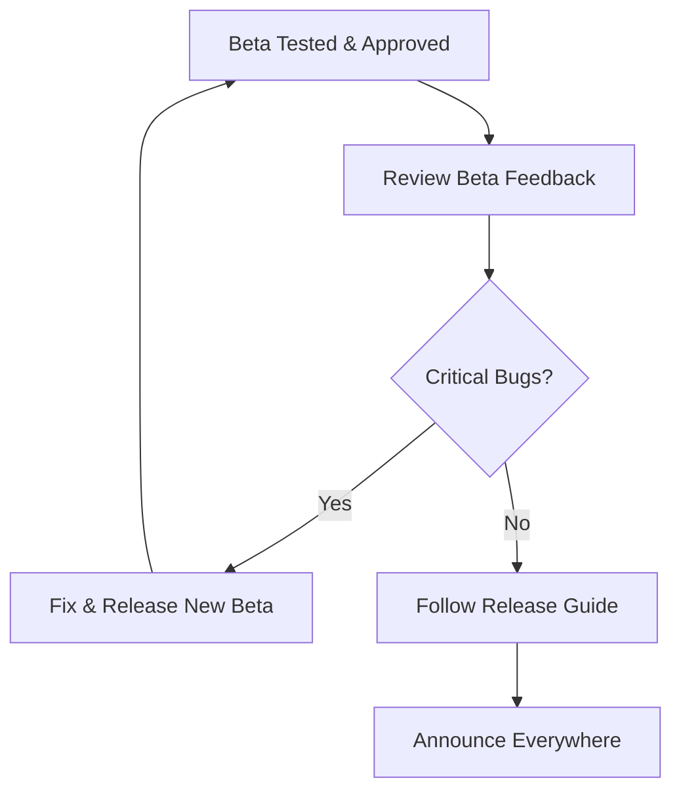

# 🚀 Release Workflow - Complete Guide

**Quick Links:**
- [Beta Release (ONE-COMMAND)](../AUTOMATED_BETA_RELEASE_PROCESS.md) ← Most common
- [Stable Release](../RELEASE_GUIDE.md)
- [Local CI Testing](../LOCAL_CI_TESTING.md)
- [Release Notes Format](../../.aidriven/rules/release_notes.md)

---

## 🎯 Overview

Linus Dashboard uses a **beta → stable** release workflow:

```
Development → Beta (automated) → Community Testing → Stable (manual)
```

### Beta Releases (Automated) 🤖

- **Trigger:** On every push to `main` branch
- **Versioning:** Auto-increment (v1.4.0-beta.1, v1.4.0-beta.2, ...)
- **Process:** ONE-COMMAND via GitHub Actions
- **Time:** ~5 minutes
- **Documentation:** [Automated Beta Process](../AUTOMATED_BETA_RELEASE_PROCESS.md)

### Stable Releases (Manual) 👤

- **Trigger:** When beta is tested and approved
- **Versioning:** Manual (v1.4.0)
- **Process:** Multi-step manual workflow
- **Time:** ~30 minutes
- **Documentation:** [Release Guide](../RELEASE_GUIDE.md)

---

## 🔄 Typical Release Cycle



**Timeline:**
1. **Develop feature** on `main` branch
2. **Push to main** → Beta release auto-created (v1.4.0-beta.1)
3. **Community testing** (Discord, GitHub, 1-7 days)
4. **Bug fixes** → New beta auto-released (v1.4.0-beta.2, beta.3, ...)
5. **Stable release** when ready (v1.4.0)
6. **Announce** on forums, social media

---

## 🧪 Beta Release (Recommended Workflow)

**When to use:** Every feature, every bug fix, every commit to `main`

### How It Works

```bash
# 1. Develop and commit your changes
git add .
git commit -m "feat: add state-aware badge icons"
git push origin main

# 2. GitHub Actions automatically:
# ✅ Runs all checks (lint, type-check, build)
# ✅ Increments beta version (v1.4.0-beta.5 → v1.4.0-beta.6)
# ✅ Builds production bundle
# ✅ Creates GitHub release
# ✅ Notifies Discord
# ✅ Updates RELEASE_NOTES.md

# 3. You get notified on Discord
# 4. Community tests the beta
# 5. Iterate if bugs are found (push again → new beta)
```

**Full documentation:** [AUTOMATED_BETA_RELEASE_PROCESS.md](../AUTOMATED_BETA_RELEASE_PROCESS.md)

### Beta Release Checklist

Before pushing to `main`:

- [ ] **Run linting** - `npm run lint` (MUST pass with 0 errors)
- [ ] **Type check** - `npm run type-check`
- [ ] **Build succeeds** - `npm run build`
- [ ] **Manual testing** - Test in Home Assistant locally
- [ ] **Commit message follows convention** - `feat:`, `fix:`, `refactor:`, etc.

After beta is released:

- [ ] **Check Discord notification** - Confirm release was announced
- [ ] **Verify GitHub release** - Check release notes are correct
- [ ] **Monitor community feedback** - Watch Discord/GitHub for issues

---

## 🎉 Stable Release

**When to use:** After beta testing is complete and successful

### Process Overview



### Steps

1. **Review beta testing feedback** (Discord, GitHub Issues)
2. **Ensure all critical bugs are fixed**
3. **Follow [Release Guide](../RELEASE_GUIDE.md)** for manual steps:
   - Update version in `manifest.json` (remove `-beta.X`)
   - Build production bundle
   - Create GitHub release
   - Update HACS metadata
   - Tag release in git
4. **Announce on:**
   - Home Assistant Community Forum
   - Home Assistant Community France (HACF)
   - Discord
   - Social media (Twitter, Instagram, Facebook)

**Full documentation:** [RELEASE_GUIDE.md](../RELEASE_GUIDE.md)

---

## 🧰 Testing Before Release

### Local CI Testing

Run the same checks as CI locally before pushing:

```bash
# Run all checks
npm run lint        # MANDATORY - Fix all errors before proceeding
npm run type-check  # TypeScript validation
npm run build       # Production build

# If all pass, you're ready to push
git push origin main
```

**Why test locally?**
- ✅ Catch issues before CI runs
- ✅ Faster feedback loop
- ✅ Avoid breaking the build for others

**Full documentation:** [LOCAL_CI_TESTING.md](../LOCAL_CI_TESTING.md)

### Manual Testing Checklist

Before releasing (beta or stable):

- [ ] **Home view** - All areas display correctly
- [ ] **Area view** - Devices show in correct room
- [ ] **Domain views** - Lights, covers, switches work
- [ ] **Chips** - Control chips function correctly
- [ ] **Badges** - State-aware icons display (v1.4.0+)
- [ ] **Embedded dashboards** - Custom views load (if configured)
- [ ] **Mobile responsive** - Test on mobile device
- [ ] **Browser cache cleared** - Test with fresh cache

**Full documentation:** [TESTING_GUIDE.md](../../.aidriven/TESTING_GUIDE.md)

---

## 📝 Release Notes

### Format

**Requirements:**
- ✅ Bilingual (English + French)
- ✅ User-facing language (not technical jargon)
- ✅ Screenshots/GIFs for major features
- ✅ Testing checklist for beta testers
- ✅ Clear "What's New" section
- ✅ Bug fixes listed
- ✅ Improvements highlighted

**Template:** See [release_notes.md](../../.aidriven/rules/release_notes.md)

**Example:** [RELEASE_NOTES.md](../../RELEASE_NOTES.md)

### Writing Great Release Notes

**Do:**
- ✅ Explain **why** the feature matters (not just what it does)
- ✅ Use screenshots/GIFs to show features visually
- ✅ Link to detailed documentation
- ✅ Provide testing instructions for beta testers
- ✅ Celebrate contributors

**Don't:**
- ❌ Use technical jargon (e.g., "Refactored AbstractChip")
- ❌ List internal code changes invisible to users
- ❌ Skip the French translation
- ❌ Forget to update version number

---

## 🔗 Related Documentation

### Release Process
- [Automated Beta Release Process](../AUTOMATED_BETA_RELEASE_PROCESS.md) - ONE-COMMAND beta releases
- [Release Guide](../RELEASE_GUIDE.md) - Manual stable release workflow
- [Local CI Testing](../LOCAL_CI_TESTING.md) - Test before pushing

### Automation & Tools
- [OpenCode Release Commands](../../.opencode/RELEASE_COMMANDS.md) - CLI shortcuts
- [Scripts README](../../scripts/README-RELEASE.md) - Release scripts details

### Development
- [Contributing Guide](../../CONTRIBUTING.md) - General contribution workflow
- [Testing Guide](../../.aidriven/TESTING_GUIDE.md) - Testing methodology
- [Release Notes Format](../../.aidriven/rules/release_notes.md) - Release notes standards

---

## 📊 Release Statistics

**Recent Release Cadence:**
- **Beta releases:** Multiple per week (automated)
- **Stable releases:** ~1 per month (manual)
- **Patch releases:** As needed for critical bugs

**Quality Metrics:**
- **CI checks:** 17 automated checks per release
- **Manual testing:** ~2 hours per stable release
- **Community testing:** 1-7 days for beta validation

---

## 🚨 Emergency Hotfix Process

For critical bugs in stable releases:

1. **Create hotfix branch** from the stable release tag
   ```bash
   git checkout -b hotfix/1.4.1 v1.4.0
   ```
2. **Fix the bug** and test thoroughly
3. **Increment patch version** (v1.4.0 → v1.4.1)
4. **Follow stable release process** (skip beta)
5. **Announce urgently** on all channels
6. **Merge back to main** to include fix in future releases

**When to use:**
- 🚨 Critical bug affecting all users
- 🚨 Security vulnerability
- 🚨 Dashboard completely broken

**When NOT to use:**
- ✅ Minor bugs → Fix in next beta
- ✅ Feature requests → Add to backlog

---

## ❓ FAQ

**Q: Should I release a beta for every commit?**
A: Yes! Every push to `main` auto-releases a beta. Community testing catches issues early.

**Q: How long should I wait before releasing stable?**
A: At least 1-3 days of beta testing. Major features may need 1 week.

**Q: Can I skip beta and release stable directly?**
A: Only for emergency hotfixes. Always use beta for features and normal bug fixes.

**Q: What if CI fails during beta release?**
A: Fix the issue locally, test with `LOCAL_CI_TESTING.md`, then push again. New beta will auto-release.

**Q: How do I rollback a bad beta release?**
A: Delete the GitHub release and notify users on Discord. Fix the issue and release new beta.

**Q: What's the difference between beta.X and stable?**
A: Beta is for testing, stable is production-ready. HACS users see both, but stable is default.

---

## 📝 Maintenance

**This document is updated:**
- When release process changes
- When automation is added/modified
- After major releases to reflect learnings

**Last updated:** 2025-12-31 (v1.4.0-beta.6)

**Maintained by:** Linus Dashboard Core Team
